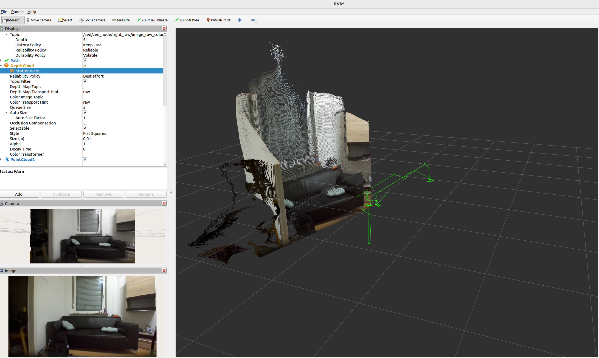

# ZED Camera on ROS 2 (Humble) — End‑to‑End Setup + RViz2 Verification

This README documents how I set up a **ZED camera** on **Ubuntu 22.04 + ROS 2 Humble** and verified everything in **RViz2**.  
It covers: installing the ZED SDK, installing the ROS 2 wrapper, and reproducing the visualizations shown in the screenshots below.

## ZED Camera Results in RViz2

### Sample image of the room


### Sample image of the room 


---

## ✅ System
- Ubuntu **22.04 (Jammy)**
- **ROS 2 Humble**
- NVIDIA GPU with proprietary driver + CUDA (required by the ZED SDK)
- ZED SDK **(installed from Stereolabs .run installer)**

---

## 1) Install ROS 2 Humble
```bash
sudo apt update
sudo apt install -y ros-humble-desktop
echo "source /opt/ros/humble/setup.bash" >> ~/.bashrc
source ~/.bashrc
```

Optional tools:
```bash
sudo apt install -y build-essential python3-colcon-common-extensions rviz2
```

---

## 2) Install the ZED SDK
1. Download the **ZED SDK for Ubuntu 22.04** from Stereolabs (x86_64).
2. Make the installer executable and run it:
   ```bash
   chmod +x ZED_SDK_Ubuntu22*.run
   ./ZED_SDK_Ubuntu22*.run
   ```
3. Follow the prompts (accept defaults).  
   After installation, you can quickly verify with the vendor demo apps (e.g., *ZED Depth Viewer*).

> **Note:** The SDK requires an NVIDIA GPU and correct driver/CUDA installation.

---

## 3) Install the ZED ROS 2 Wrapper
The wrapper publishes camera images, depth, point clouds, odometry, object/body tracking, and more.

**Option A — From apt (quickest):**
```bash
sudo apt update
sudo apt install -y ros-humble-zed-ros2-wrapper
```

**Option B — From source (if you want latest):**
```bash
mkdir -p ~/zed_ws/src && cd ~/zed_ws/src
git clone https://github.com/stereolabs/zed-ros2-wrapper.git
cd ..
rosdep update
rosdep install --from-paths src --ignore-src -r -y
colcon build
source install/setup.bash
```

---

## 4) Launch the camera
Examples below show **ZED 2i**; switch `camera_model` to your device (e.g., `zed2`, `zedx`, etc.).

```bash
# If installed via apt:
source /opt/ros/humble/setup.bash
ros2 launch zed_wrapper zed_camera.launch.py camera_model:=zed2i publish_tf:=true
```

**Enable Body/Objects tracking (optional):**
```bash
ros2 launch zed_wrapper zed_camera.launch.py camera_model:=zed2i       object_detection:=true obj_det_model:=HUMAN_BODY_FAST       publish_tf:=true
```
This will publish topics like:
- `/zed/zed_node/left/image_rect_color`
- `/zed/zed_node/depth/depth_registered`
- `/zed/zed_node/point_cloud/cloud`
- `/zed/zed_node/odom`
- `/zed/zed_node/body_trk/skeletons` (when body tracking is enabled)

---

## 5) RViz2 — Quick verification
In a new terminal:
```bash
source /opt/ros/humble/setup.bash
rviz2
```

**Global Options**
- `Fixed Frame`: `map` (or `odom`, depending on your TF tree)

**Displays to add:**
- **Image** → Topic: `/zed/zed_node/right_raw/image_raw_color` (or left rectified color topic)
- **PointCloud2** → Topic: `/zed/zed_node/point_cloud/cloud`
- **Path** → Topic: `/zed/zed_node/pose/path_map` (or your available path topic)
- **Body Tracking** *(if enabled)* → Topic: `/zed/zed_node/body_trk/skeletons`
- **Camera** (for overlay view with depth) → Topic: `/zed/zed_node/depth/depth_registered`

**QoS (RViz2)**
- For Image/PointCloud2 in ROS 2, set `Reliability Policy = Reliable` and `Durability = Volatile` if needed.

---

## 6) References
- ZED SDK (Stereolabs) — installer for Ubuntu 22.04  
- `zed-ros2-wrapper` — ROS 2 integration (apt or source)

---

**Result:** With the steps above I successfully brought up the ZED camera on **ROS 2 Humble**, verified images, depth, point cloud, path, and **body tracking** in **RViz2** — matching the screenshots included here.
